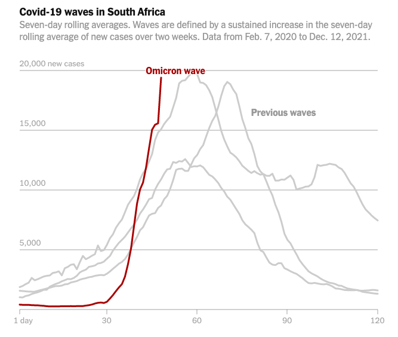

# Report: Analysis of Omicron Variant Visualization

## By Zihan Lin

*Date: July 10, 2023*

## Data Viz Summary

### 

This data visualization from *The New York Time* provides a comprehensive overview of Omicron variant of the COVID-19 virus in South Africa. It presents how the Omicron COVID-19 cases increase rapidly in South Africa in past few weeks,and potential impact on vaccine effectiveness. In the article *Data Feminism*, the author mention that "Data visualization have the power to reveal patterns and create new understandings of how world works." The data visualization showing above have the power to let viewers understand the complex growing pattern of Omicron variant happen in the world, and provide good example for public health strategies and global response.

## Data Viz Biography

1.  **Who or what institution produced the visualization?** 

The visualization was produced by The New York Time.

2.  **When was it produced?** 

It was produced in December 14th 2021.

3.  **Who is the audience for the visualization?** 

The audience for this visualization are general public, government, and researchers who are interested in Omicron COVID-19th.

4.  **How might the visualization be interpreted or misinterpreted? What consequences might this interpretation/misinterpretation have?** 

The visualization may interpreted as the Omicron COVID-19 virus spread faster than normal COVID-19 virus, which will cause general public panic, and down turn of economic caused by Omicron COVID-19.

5.  **How, if at all, does the data visualization represent power or systems?** 

The data visualization represent power by underlining the global impact of Omicron COVID-19.

🔗 [Data Feminism](https://data-feminism.mitpress.mit.edu/)

Emoji: 😧
